# fugle-tradingview-webhooks

> NestJS x Fugle API x TradingView Webhooks：讓富果交易 API 與 TradingView Webhooks 共舞

## 前言

在當今迅速發展的金融科技領域，程式交易正逐漸成為投資者追求更有效利用市場的重要手段。透過程式化的交易策略，投資者能夠快速做出反應，降低人為因素的介入，並提高交易的效率與準確性。

本文將介紹如何運用 NestJS 整合富果交易 API 與 TradingView Webhooks，打造一個強大的自動化交易平台。透過富果 API，我們能夠執行下單委託，而 TradingView Webhooks 則提供即時的技術分析信號。將這兩者結合，可實現更智慧、更靈活的交易策略。此外，搭配 LINE Notify 應用，可即時接收交易通知，達到全自動、即時的交易決策。

## 目錄

- [事前準備](#事前準備)
  - [安裝 Node.js](#安裝-nodejs)
  - [安裝 Nest CLI](#安裝-nest-cli)
  - [申請 Fugle 交易 API](#申請-fugle-交易-api)
  - [註冊 TradingView 帳號](#註冊-tradingview-帳號)
  - [取得 LINE Notify 存取權杖](#取得-line-notify-存取權杖)
- [建立股票下單程式](#建立股票下單程式)
  - [股票下單程式的運作](#股票下單程式的運作)
  - [建立 Nest 應用程式](#建立-nest-應用程式)
  - [安裝依賴模組](#安裝依賴模組)
  - [設定環境變數](#設定環境變數)
- [實作股票下單服務](#實作股票下單服務)
  - [整合下單與帳戶服務](#整合下單與帳戶服務)
  - [處理主動回報訊息](#處理主動回報訊息)
- [實作股票下單 API](#實作股票下單-api)
  - [處理股票下單 API 請求](#處理股票下單-api-請求)
  - [設定股票下單 API 白名單](#設定股票下單-api-白名單)
  - [測試股票下單 API](#測試股票下單-api)
- [整合 TradingView Webhooks](#整合-tradingview-webhooks)
  - [TradingView 快訊](#tradingview-快訊)
  - [TradingView Webhooks](#tradingview-webhooks)
  - [整合 TradingView Webhooks 的系統運作](#整合-tradingview-webhooks-的系統運作)
  - [使用 ngrok 測試 Webhook URL](#使用-ngrok-測試-webhook-url)
  - [設定 TradingView 快訊與 Webhooks](#設定-tradingview-快訊與-webhooks)
  - [透過 TradingView Webhook 執行自動化下單](#透過-tradingview-webhook-執行自動化下單)

## 事前準備

在開始實作前，請先準備好你的開發環境，正如俗話說：「工欲善其事，必先利其器。」

安裝開發環境時，請留意不同作業系統和版本之間的差異，為確保安裝工具能順利運作，請先確認你的本機執行環境，詳細閱讀官方文件和教學後，再進行安裝及相關設定。

### 安裝 Node.js

**Node.js** 是基於 Chrome V8 JavaScript 引擎的開放原始碼、跨平台、可用於伺服器端應用程式的執行環境，它提供事件驅動、非阻塞的I/O 模型，讓你能有效率地建立可擴展的網路應用程式。

<figure>
  
  <figcaption><em>圖 1：Node.js</em></figcaption>
  <br><br>
</figure>

首先，你需要安裝 Node.js 環境，請前往 Node.js [官方網站](https://nodejs.org) 下載適合你作業系統的安裝檔，通常建議選擇 LTS（Long Term Support）版本，這是官方提供長期支援的穩定版本。當然，如果你想體驗 Node.js 最新功能，也可以選擇下載最新版。

<figure>
  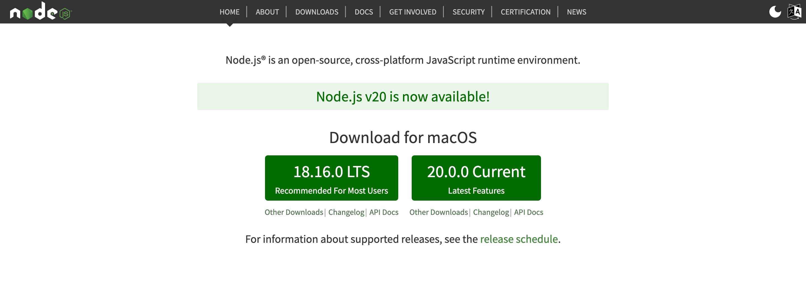
  <figcaption><em>圖 2：Node.js 官方網站</em></figcaption>
  <br><br>
</figure>

| TIP: |
| :--- |
| 你還可以使用 [NVM](https://github.com/nvm-sh/nvm)（Node Version Manager）這個版本管理工具來安裝 Node.js，它能讓你輕鬆切換不同版本的 Node.js。NVM 也有 [Windows](https://github.com/coreybutler/nvm-windows) 版本，你可以根據作業系統環境來進行安裝。 |

### 安裝 Nest CLI

**Nest**（NestJS）是基於 Node.js 和 TypeScript 開發的框架，能幫助你打造高效、可靠且易於擴展的應用程式，它提供了多種實用功能，支援常用的伺服端技術。透過模組化的結構，你能更方便地管理和組織程式碼。

<figure>
  
  <figcaption><em>圖 3：NestJS</em></figcaption>
  <br><br>
</figure>

Nest CLI 是由 NestJS 提供的命令列工具，能讓你輕鬆地建立、執行和管理 Nest 應用程式的各種操作。只要你已安裝好 Node.js，打開終端機並執行以下指令，即可安裝 Nest CLI：

```sh
$ npm install -g @nestjs/cli
```

安裝完成後，你可以輸入以下指令，查看 Nest CLI 提供的指令及其使用方式：

```sh
$ nest -h
```

<figure>
  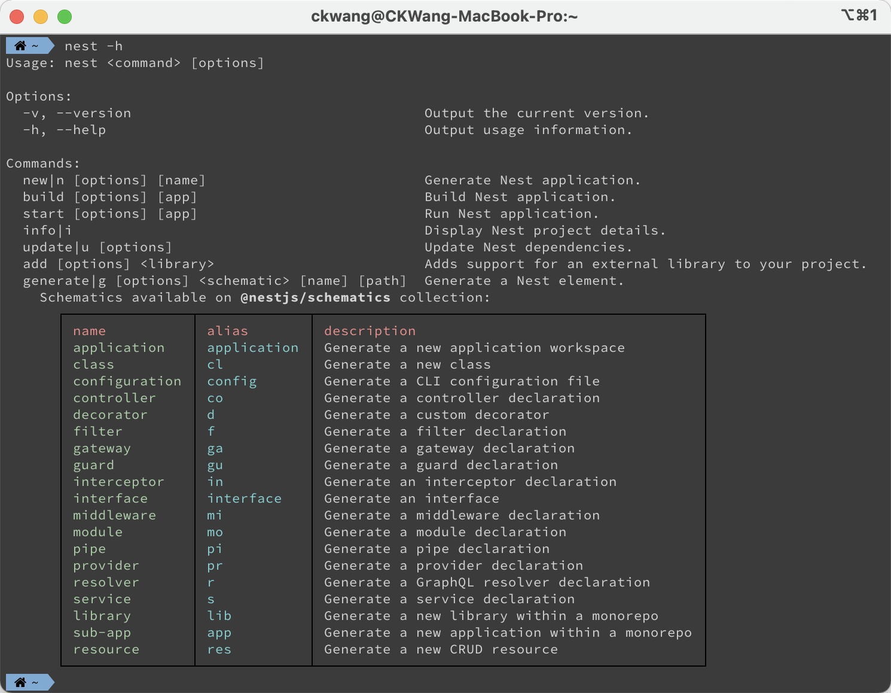
  <figcaption><em>圖 4：Nest CLI 指令列表</em></figcaption>
  <br><br>
</figure>

### 申請 Fugle 交易 API

富果交易 API 是由富果技術團隊與玉山證券合作開發的程式交易 API，你可以在 Windows、Mac 和 Linux 平台上利用富果提供的 SDK，在台灣股票市場進行程式交易，只要你完成開立 [玉山證券富果帳戶](https://openaccount.fugle.tw/?referral=f-4ddec21&utm_source=referral&utm_medium=link&openExternalBrowser=1)，並簽署「API 服務申請同意書」，就可以透過線上申請取得交易權限。富果交易 API 同時提供了 Node.js SDK 以及 NestJS 模組，你可以很輕鬆地將它整合至應用程式。

<figure>
  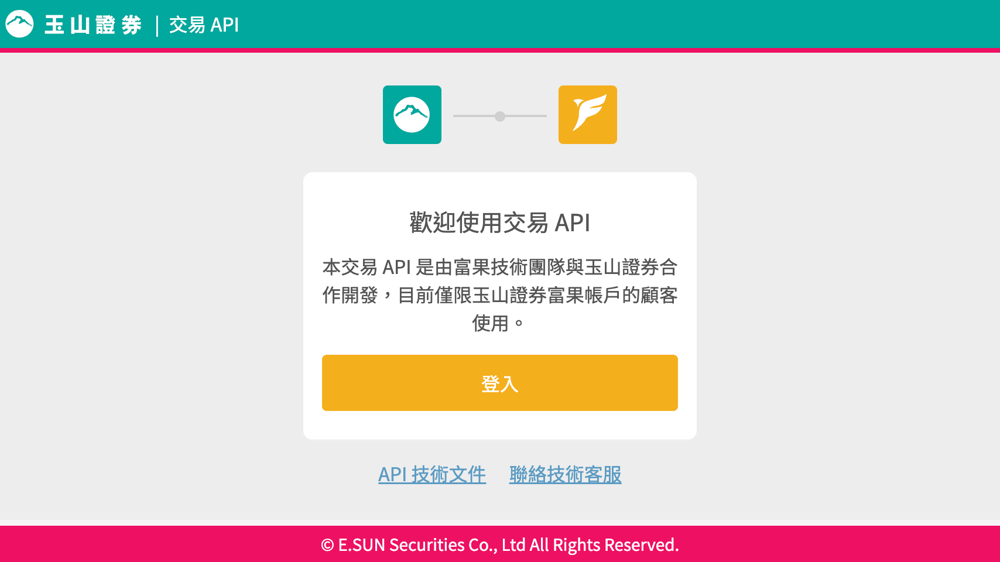
  <figcaption><em>圖 5：富果交易 API</em></figcaption>
  <br><br>
</figure>

在進行正式交易前，你需要先完成富果交易 API 文件中的 [事前準備](https://developer.fugle.tw/docs/trading/prerequisites/)，包含申請使用交易 API 服務，並且進行模擬測試，以確保程式運作正常；完成這些步驟後，即可獲得正式環境交易權限，開始體驗程式交易所帶來的便捷與效率。

### 註冊 TradingView 帳號

[TradingView](https://tradingview.com/) 是一個廣受歡迎的金融市場視覺化平台，提供了豐富的圖表和分析工具，以協助交易者進行技術分析和制定交易策略。該平台不僅支援股票市場，還包括外匯、加密貨幣、商品等多種金融市場。

<figure>
  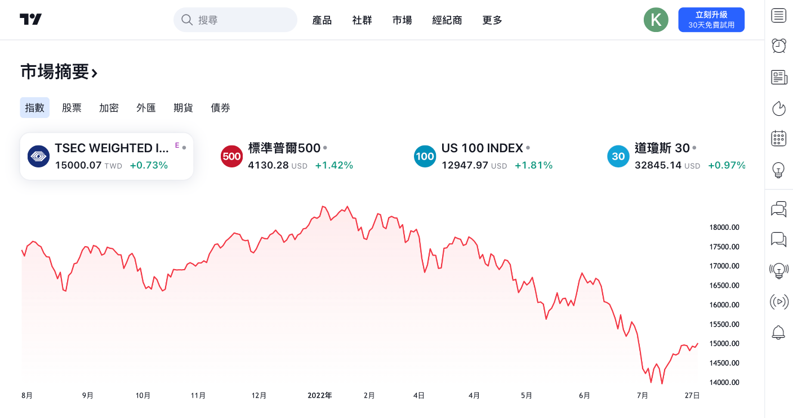
  <figcaption><em>圖 6：TradingView</em></figcaption>
  <br><br>
</figure>

如果你還沒有，請至 TradingView 網站 [註冊](https://tw.tradingview.com/pricing/) 一個帳號。

### 取得 LINE Notify 存取權杖

請確認你已經註冊並認證了你的 LINE 帳號。如果沒有，請先在你的行動裝置下載 LINE App 來完成註冊和認證。

**STEP 1**：前往 LINE Notify 首頁（notify-bot.line.me），登入你的 LINE 帳號後，點選「個人頁面」。
 
<figure>
  
  <figcaption><em>圖 7</em></figcaption>
  <br><br>
</figure>

**STEP 2**：跳轉頁面後，選擇「發行權杖」。
 
<figure>
  
  <figcaption><em>圖 8</em></figcaption>
  <br><br>
</figure>

| NOTE: |
| :--- |
| LINE Notify 授權是基於 OAuth 2.0 的授權碼（Authorization Code）模式。這種授權機制能讓你的應用程式能夠安全地取得其他使用者的同意。如果你只需要將訊息透過 LINE Notify 推播給自己，則直接選擇「發行權杖」即可。 |

**STEP 3**：接著會跳出一個表單視窗。請填寫權杖名稱，然後接收通知的聊天室請選擇「透過1對1聊天接收Line Notify的通知」，然後點選「發行」。
 
<figure>
  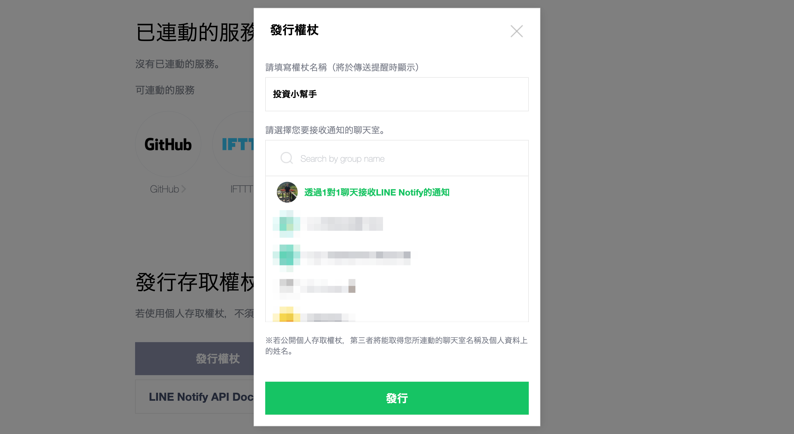
  <figcaption><em>圖 9</em></figcaption>
  <br><br>
</figure>

**STEP 4**：LINE Notify 將產生你的個人存取權杖（Access Token）。因為這段代碼只會出現一次，請務必記住這組權杖代碼。
 
<figure>
  
  <figcaption><em>圖 10</em></figcaption>
  <br><br>
</figure>

**STEP 5**：完成後，在「連動的服務」清單裡，就會出現我們剛剛所設定的服務。

<figure>
  
  <figcaption><em>圖 11</em></figcaption>
  <br><br>
</figure>

## 建立股票下單程式

我們將建立一個整合富果交易 API 的功能的股票下單程式，你可以透過它進行委託下單、查詢帳務，同時也能隨時收到主動回報通知，這讓你能方便進行股票交易，並即時獲得相關的資訊回應。

### 股票下單程式的運作

在開始實作前，我們先瞭解股票下單程式如何運作。如系統環境圖（見圖 12）所示，主要包含以下元件：

- 股票下單 API：透過 REST 風格的 HTTP API，進行下單委託與帳務查詢。
- 股票下單服務：整合富果交易 SDK 功能，並且處理 API 請求。當收到富果交易系統的資訊回報時，透過 LINE Notify 傳送通知。

<figure>
  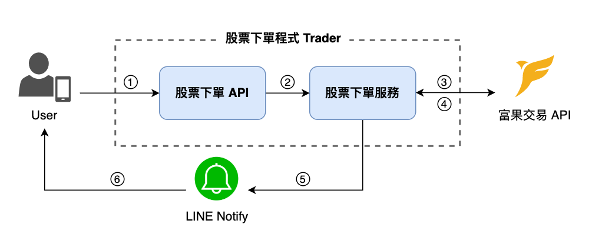
  <figcaption><em>圖 12：股票下單程式的運作</em></figcaption>
  <br><br>
</figure>

當使用者透過股票下單程式進行下單委託時，其資料處理流程如下：

- ① 使用者向股票下單 API 發送請求，進行下單委託。
- ② 股票下單服務處理使用者向股票下單 API 發送的請求。
- ③ 股票下單服務向富果交易 API 發送下單委託請求。
- ④ 股票下單服務接收富果交易 API 的主動回報訊息。
- ⑤ 收到委託或成交回報時，股票下單服務向 LINE Notify 請求推播訊息。
- ⑥ LINE Notify 收到推播請求後，將訊息發送給使用者。

### 建立 Nest 應用程式

首先，請打開終端機，使用 Nest CLI 建立一個名為 `fugle-tradingview-webhooks` 的 Nest 應用程式：

```sh
$ nest new fugle-tradingview-webhooks
```

應用程式建立後，我們需要調整 Nest CLI 預設產生的內容。請將應用程式 `AppModule` 修改如下：

```ts
import { Module } from '@nestjs/common';

@Module({})
export class AppModule {}
```

| NOTE: |
| :--- |
| 我們不會用上預設建立的 `AppController` 與 `AppService`，你可以移除相關檔案。 |

### 安裝依賴模組

請在終端機輸入以下指令安裝相關套件：

```sh
$ npm install --save @fugle/trade @fugle/trade-nest @nestjs/config nest-line-notify class-validator class-transformer
```

以下是各個套件的簡要說明： 

- `@fugle/trade`: 富果交易 API 客戶端函式庫。
- `@fugle/trade-nest`: 提供在 NestJS 應用程式中整合 `@fugle/trade` 的模組。 
- `@nestjs/config`: NestJS 的配置模組，可用於管理應用程式中的配置參數。 
- `nest-line-notify`: 在 NestJS 應用程式中整合 Line Notify 服務的套件，可用於發送 Line 通知。
- `class-validator`: 用於驗證和確保類別實例符合特定的規則。
- `class-transformer`: 用於在 TypeScript/JavaScript 中實現物件轉換和序列化。

安裝完成後，請在 `AppModule` 中匯入相關模組：

```ts
import { Module } from '@nestjs/common';
import { ConfigModule } from '@nestjs/config';
import { FugleTradeModule } from '@fugle/trade-nest';
import { LineNotifyModule } from 'nest-line-notify';

@Module({
  imports: [
    ConfigModule.forRoot(),
    FugleTradeModule.forRoot({
      config: {
        apiUrl: process.env.FUGLE_TRADE_API_URL,
        certPath: process.env.FUGLE_TRADE_CERT_PATH,
        apiKey: process.env.FUGLE_TRADE_API_KEY,
        apiSecret: process.env.FUGLE_TRADE_API_SECRET,
        aid: process.env.FUGLE_TRADE_AID,
        password: process.env.FUGLE_TRADE_PASSWORD,
        certPass: process.env.FUGLE_TRADE_CERT_PASS,
      },
    }),
    LineNotifyModule.forRoot({
      accessToken: process.env.LINE_NOTIFY_ACCESS_TOKEN,
    }),
  ],
})
export class AppModule {}
```

### 設定環境變數

請在專案目錄下建立 `.env` 檔案，新增以下內容：

```
FUGLE_TRADE_CERT_PATH=
FUGLE_TRADE_API_URL=
FUGLE_TRADE_API_KEY=
FUGLE_TRADE_API_SECRET=
FUGLE_TRADE_AID=
FUGLE_TRADE_PASSWORD=
FUGLE_TRADE_CERT_PASS=
LINE_NOTIFY_ACCESS_TOKEN=
```

這些變數所代表的意義與用途如下：

- `FUGLE_TRADE_API_URL`：富果交易 API URL。
- `FUGLE_TRADE_API_KEY`：富果交易 API 金鑰。
- `FUGLE_TRADE_API_SECRET`：富果交易 API 私鑰。
- `FUGLE_TRADE_AID`：證券帳號。
- `FUGLE_TRADE_PASSWORD`：帳號密碼。
- `FUGLE_TRADE_CERT_PASS`：憑證密碼。
- `FUGLE_TRADE_CERT_PATH`：憑證路徑。
- `LINE_NOTIFY_ACCESS_TOKEN`：LINE Notify 存取權杖。

你需要將這些環境變數的值填入，才能讓應用程式正常運作。

| TIP: |
| :--- |
| 這些環境變數的值可以從設定檔中取得。你需要從富果交易 API [網站](https://fugletradingapi.esunsec.com.tw)，申請 API 金鑰，並且取得設定檔與憑證。 |

## 實作股票下單服務

完成應用程式的基本設定後，我們建立一個模組來整合富果交易 API 的下單功能與帳務服務。請打開終端機，使用 Nest CLI 建立 `TraderModule`：

```sh
$ nest g module trader
```

我們將在這個模組實作相關功能，讓你能透過SDK操作你的證券帳戶。

### 整合下單與帳戶服務

我們建立一個服務來負責整合富果交易 SDK 功能。請使用 Nest CLI建立 `TraderService`：

```sh
$ nest g service trader --no-spec
```

執行後，請開啟建立的檔案，在 `TraderServic` 中使用 `@InjectFugleTrade()` 裝飾器依賴注入 `FugleTrade`，並且新增以下方法：

```ts
...
@Injectable()
export class TraderService {
  constructor(@InjectFugleTrade() private readonly fugle: FugleTrade) {}

  async getOrders() {
    return this.fugle.getOrders()
      .then(orders => orders.map(order => order.payload))
      .catch(err => {
        throw new InternalServerErrorException(err.message);
      });
  }

  async placeOrder(placeOrderDto: PlaceOrderDto) {
    const payload = placeOrderDto as OrderPayload;
    const order = new Order(payload);
    return this.fugle.placeOrder(order)
      .catch(err => {
        throw new InternalServerErrorException(err.message);
      });
  }

  async replaceOrder(id: string, replaceOrderDto: ReplaceOrderDto) {
    const orders = await this.fugle.getOrders();
    const order = orders.find(order =>
      [order.payload.ordNo, order.payload.preOrdNo].includes(id)
    );
    if (!order) throw new NotFoundException('order not found');

    return this.fugle.replaceOrder(order, replaceOrderDto)
      .catch(err => {
        throw new InternalServerErrorException(err.message);
      });
  }

  async cancelOrder(id: string) {
    const orders = await this.fugle.getOrders();
    const order = orders.find(order =>
      [order.payload.ordNo, order.payload.preOrdNo].includes(id)
    );
    if (!order) throw new NotFoundException('order not found');

    return this.fugle.cancelOrder(order)
      .catch(err => {
        throw new InternalServerErrorException(err.message);
      });
  }

  async getTransactions(getTransactionsDto: GetTransactionsDto) {
    const { range } = getTransactionsDto;
    return this.fugle.getTransactions(range)
      .catch(err => {
        throw new InternalServerErrorException(err.message);
      });
  }

  async getInventories() {
    return this.fugle.getInventories()
      .catch(err => {
        throw new InternalServerErrorException(err.message);
      });
  }

  async getSettlements() {
    return this.fugle.getSettlements()
      .catch(err => {
        throw new InternalServerErrorException(err.message);
      });
  }

  async getBalance() {
    return this.fugle.getBalance()
      .catch(err => {
        throw new InternalServerErrorException(err.message);
      });
  }
  ...
}
```

這些方法對應了富果交易 SDK 提供的下單委託以及帳務查詢等功能：

- `getOrders()`：查詢當日證券帳戶內的所有委託，包含預約單、進行中、已成交或已取消的委託單。
- `placeOrder()`：下一筆交易委託單。非交易時段內下單則為預約單。
- `replaceOrder()`：修改指定的預約單或進行中委託單的價格或數量。
- `cancelOrder()`：取消指定的預約單或進行中委託單。
- `getTransactions()`：取得證券帳戶的交易明細。可選擇不同時間範圍查詢交易記錄。
- `getInventories()`：查詢證券帳戶的庫存股票資訊。
- `getSettlements()`：查詢證券帳戶的交割資訊，包含應收及應付款項。
- `getBalance()`：查詢交割銀行帳戶餘額。

| TIP: |
| :--- |
| 關於這些方法的參數以及回傳內容，請參考 `@fugle/trade` 的 [文件](https://github.com/fugle-dev/fugle-trade-node/blob/master/doc/fugle-trade-zh-TW.md) 說明。 |

### 處理主動回報訊息

整合富果交易 SDK 功能後，還必須處理主動回報訊息；主動回報是指證券商系統即時向你提供委託或成交回報、異常情況和錯誤訊息等資訊。
為了處理這些主動回報，你可以使用 `@fugle/trade-nest` 提供的 `@Streamer` 裝飾器來監聽事件，並執行相應的處理。請在 `TraderService` 中新增以下方法：

```ts
...
@Injectable()
export class TraderService {
  ...
  @Streamer.OnConnect()
  async onConnect() {
    ...
  }

  @Streamer.OnDisconnect()
  async onDisconnect() {
    ...
  }

  @Streamer.OnOrder()
  async onOrder(data) {
    ...
  }

  @Streamer.OnTrade()
  async onTrade(data) {
    ...
  }

  @Streamer.OnError()
  async onError(err) {
    ...
  }
}
```

這些方法用於處理主動回報事件，包含：

- `onConnect()`：當 Streamer 連線建立時的處理。
- `onDisconnect()`：當 Streamer 連線關閉時的處理。
- `onOrder()`：收到委託回報時的處理。可根據委託回報的資料組合一個訊息，然後透過 LINE Notify 推播訊息。
- `onTrade()`：收到成交回報時的處理。可根據成交回報的資料組合一個訊息，然後透過 LINE Notify 推播訊息。
- `onError()`：當 Streamer 發生錯誤時的處理。

為了將收到的委託或成交回報資訊轉換成易於閱讀的文字訊息，我們在程式中定義了一些工具函式，這些函式負責解析收到的主動回報訊息，並將相關資訊整理成可推送的通知。你可以參考範例程式碼，深入瞭解實際的運作方式。

## 實作股票下單 API

我們已將富果交易 SDK 整合至應用程式，並能接收與處理主動回報，接下來我們將加入股票下單 API，讓你能透過 HTTP 請求來操作證券帳戶。

### 處理股票下單 API 請求

我們在股票下單模組中建立控制器來處理API請求。請打開終端機，使用 Nest CLI 建立 `TraderController`：

```sh
$ nest g controller trader --no-spec
```

執行後，請開啟建立的檔案，在 `TraderController` 中依賴注入 `TraderService`，並新增以下方法：

```ts
...
@Controller('trader')
export class TraderController {
constructor(private readonly traderService: TraderService) {}
  @Get('/orders')
  async getOrders() {
    return this.traderService.getOrders();
  }

  @Post('/orders')
  async placeOrder(@Body() placeOrderDto: PlaceOrderDto) {
    return this.traderService.placeOrder(placeOrderDto);
  }
  
  @Patch('/orders/:id')
  async replaceOrder(@Param('id') id: string, @Body() replaceOrderDto: ReplaceOrderDto) {
    return this.traderService.replaceOrder(id, replaceOrderDto);
  }

  @Delete('/orders/:id')
  async cancelOrder(@Param('id') id: string) {
    return this.traderService.cancelOrder(id);
  }

  @Get('/transactions')
  async getTransactions(@Query() getTransactionsDto: GetTransactionsDto) {
    return this.traderService.getTransactions(getTransactionsDto);
  }

  @Get('/inventories')
  async getInventories() {
    return this.traderService.getInventories();
  }
  
  @Get('/settlements')
  async getSettlements() {
    return this.traderService.getSettlements();
  }

  @Get('/balance')
  async getBalance() {
    return this.traderService.getBalance();
  }
}
```

這些方法都是對應到不同的 HTTP 請求路徑和方法，並經由 `TraderService` 處理請求。

為了讓每個路由都透過 `ValidationPipe` 進行驗證程序，請在應用程式 `main.ts` 檔案中加入 `useGlobalPipes()` 方法，使其作用為全域範圍：

```ts
...
async function bootstrap() {
  const app = await NestFactory.create(AppModule);
  app.useGlobalPipes(
    new ValidationPipe({
      transform: true,
      transformOptions: {
      enableImplicitConversion: true,
      },
    }),
  );
  await app.listen(3000);
}
bootstrap();
```

設定完成後，若 API 收到的請求不符合驗證規則，則回傳相關錯誤訊息。

### 設定股票下單 API 白名單

由於股票下單程式涉及金融交易，為了確保交易命令是由你本人執行，我們建議設定「白名單」來限制只有特定 IP 位址才能存取股票下單 API。

為了設定白名單來過濾傳入的請求，請打開終端機，安裝以下套件：

```sh
$ npm install --save nestjs-ip-filter
```

| NOTE: |
| :--- |
| `nestjs-ip-filter` 提供的 `IpFilter` 模組也可以用來設定黑名單 IP 位址。詳細使用方式請參考官方 [文件](https://github.com/awesometic/nestjs-ip-filter) 的說明。 |

安裝完成後，請在應用程式 `AppModule` 中匯入 `IpFilter` 模組：

```ts
...
@Module({
  imports: [
    ...
    IpFilter.register({
    whitelist: String(process.env.ALLOWED_IPS).split(','),
    }),
  ],
})
export class AppModule {}
```

`IpFilter` 模組的作用是根據白名單來過濾請求來源位址。我們透過環境變數來設定白名單的IP位址，請在專案目錄下的 `.env` 檔案加入：

```
ALLOWED_IPS=
```

請將接受的 IP 位址以逗號「,」分隔，完成設定後，只有在白名單上的 IP 位址，才可以存取股票下單 API；如果請求來自白名單以外的 IP 位址，則會拒絕請求並回傳錯誤訊息。

### 測試股票下單 API

完成股票下單 API 後，可啟動應用程式進行測試。請打開終端機，執行以下指令：

```sh
$ npm start trader
```

你可以透過 `curl` 指令或其他工具測試 API 功能是否正常（見表 1）。

<p>表 1：股票下單 API</p>

| HTTP 方法 | 路徑 | 作用 |
|----------|----------------------|---------------|
| `POST`   | `/trader/orders`       | 新增一個委託單 |
| `GET`    | `/trader/orders`       | 取得所有委託單 |
| `PATCH`  | `/trader/orders/:id`   | 修改指定委託單 |
| `DELETE` | `/trader/orders/:id`   | 取消指定委託單 |
| `GET`    | `/trader/transactions` | 取得交易明細 |
| `GET`    | `/trader/inventories`  | 取得帳戶庫存 |
| `GET`    | `/trader/settlements`  | 取得交割資訊 |
| `GET`    | `/trader/balance`      | 取得銀行餘額 |

現在，你可以透過股票下單 API 來進行下單委託和查詢帳務等功能，當你成功下了一筆交易委託，程式將會收到券商的主動回報訊息，並且透過 LINE Notify 推播通知訊息（見圖 13）。

<figure>
  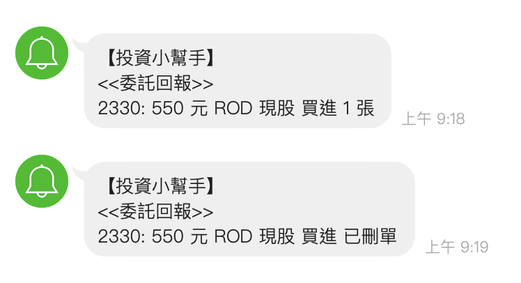
  <figcaption><em>圖 13：收到委託回報的 LINE Notify 訊息推播</em></figcaption>
  <br><br>
</figure>

| TIP: |
| :--- |
| 如果你對富果股市API有任何疑問，建議前往 富果 API [社群](https://discord.gg/VHjjc4C) 尋求支援。你可以向技術客服提問，或與其他社群成員交流，找到適合你的解決方案。 |

## 整合 TradingView Webhooks

TradingView 是一個線上金融市場分析平台，它提供了強大的圖表工具、技術分析指標、交易信號和社交交流功能。其中，TradingView 的 **快訊** (Alerts) 的與 **Webhooks** 的功能，允許用戶根據特定條件設置交易策略，當這些條件得到滿足時，系統會發送通知。

### TradingView 快訊

**TradingView 快訊**（Alerts）可以用於即時行情監控，當股價滿足設定條件時，TradingView 快訊會立即發出通知。TradingView 快訊除了以 App 通知、Web 顯示彈出視窗以及發送電郵外，還可以設定以 Webhooks 發出快訊。

根據 TradingView 用戶所屬的 [方案](https://tw.tradingview.com/gopro/)，提供不同的快訊數量：

- 免費用戶只能建立 1 個快訊。
- Essential 用戶可以立建 20 個快訊。
- Plus 用戶可以建立 100 個快訊。
- Premium 用戶可以建立 400 個快訊，且可以額外擁有秒級快訊。

### TradingView Webhooks

**TradingView Webhooks** 功能是一種進階的通知機制，可以在每次觸發快訊時，將 POST 請求發送到指定的 URL，整合到其他平台或應用程式中。這使得用戶能夠更靈活地管理快訊，並在需要時自動執行預定義的交易策略。

需要注意的是，Webhooks 功能僅限於 TradingView 的付費用戶使用。但如果願意花點錢升級成 **Pro** 以上的方案，Webhooks 確實是實現自動化交易非常實用的工具。目前 TradingView 提供的臺灣股市行情數據，**證券櫃檯買賣中心** 掛牌的股票（上櫃、興櫃）是即時行情，**臺灣證券交易所** 掛牌的股票（上市）則延遲行情 15 分鐘。如果要取得上市股票的最新報價，需要額外付費訂閱臺灣證券交易所的行情數據。

### 整合 TradingView Webhooks 的系統運作

股票下單程式整合 TradingView Webhooks 的運作如系統環境圖（見圖 14）所示。

<figure>
  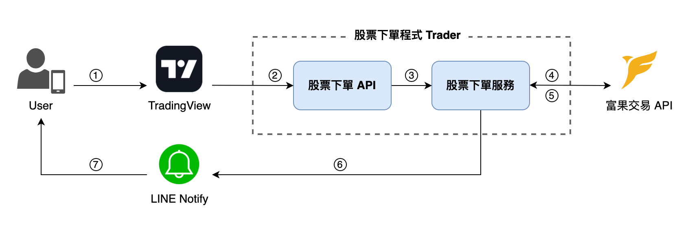
  <figcaption><em>圖 14：整合 TradingView Webhooks 的系統運作</em></figcaption>
  <br><br>
</figure>

當使用者透過 TradingView 設定快訊與 Webhooks 來進行下單委託時，其資料處理流程如下：

- ① 使用者在 TradingView 設置快訊。
- ② 快訊條件觸發時，TradingView 以 Webhook 方式向股票下單 API 發送請求，進行下單委託。
- ③ 股票下單服務處理使用者向股票下單 API 發送的請求。
- ④ 股票下單服務向富果交易 API 發送下單委託請求。
- ⑤ 股票下單服務接收富果交易 API 的主動回報訊息。
- ⑥ 收到委託或成交回報時，股票下單服務向 LINE Notify 請求推播訊息。
- ⑦ LINE Notify 收到推播請求後，將訊息發送給使用者。

### 使用 ngrok 測試 Webhook URL

[ngrok](https://ngrok.com/) 是一個跨平台的應用程式，可以將本地端伺服器公開到 Internet，而讓外部網路存取內部網路伺服器。

由於 Webhook 提供者當在發生某些事件時會傳送 POST 請求，所以 Webhook URL 必須是可以在網際網路上公開造訪的。當我們在本地端伺服器測試時 Webhook 時，ngrok 就是一個非常好用的工具，可以快速將 `localhost` 透過 ngrok 作爲反向代理讓外部存取。

要取得 ngrok 可以至官方網站 [Download](https://ngrok.com/download) 頁面下載，根據您的作業系統平台依照指令操作即可安裝 ngrok。

當 ngrok 安裝完成後，可以打開終端機使用 `ngrok` 指令啟用反向代理：

```sh
$ ngrok http 3001
```

<figure>
  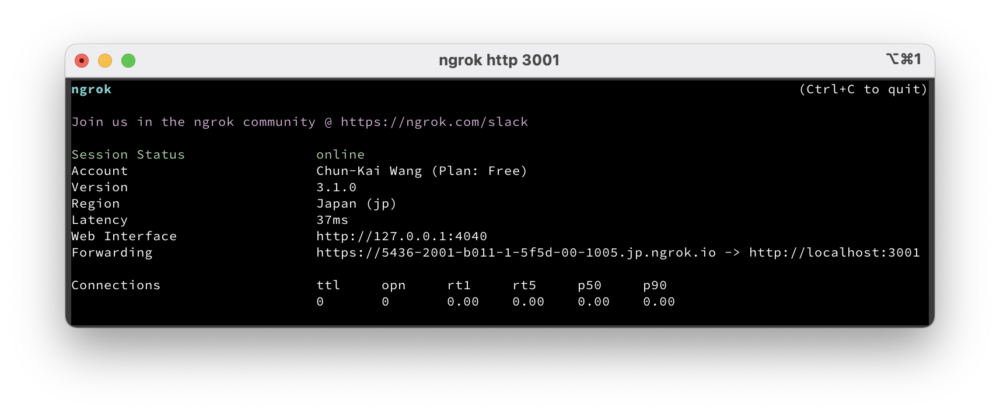
  <figcaption><em>圖 15：ngrok</em></figcaption>
  <br><br>
</figure>

以上圖為例，網址 `https://5436-2001-b011-1-5f5d-00-1005.jp.ngrok.io` 指向 `http://localhost:3001`。在開發測試時，可以使用 `https://5436-2001-b011-1-5f5d-00-1005.jp.ngrok.io` 作爲 Webhook URL。

| NOTE: |
| :--- |
| ngrok 適用於本地端開發，如果您的應用程式已經上線，則可以忽略這個步驟。 |

### 設定 TradingView 快訊與 Webhooks

我們示範如何在 TradingView 上建立快訊與 Webhooks 設定。進入 [TradingView](https://tw.tradingview.com/) 網站後，在畫面右手邊可以找到快訊。

<figure>
  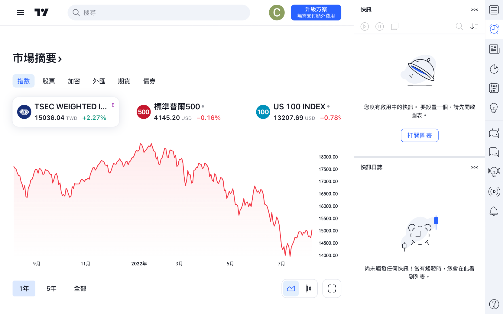
  <figcaption><em>圖 16</em></figcaption>
  <br><br>
</figure>

我們必須進入圖表才能設定快訊，以下以 **台積電** (2330) 為例，設定觸發條件、選項、到期時間和快訊動作。請在快訊動作勾選「Webhook URL」。

<figure>
  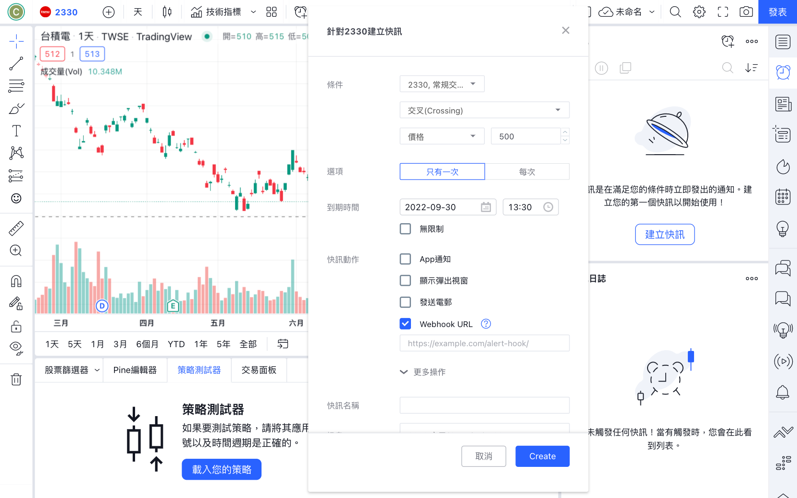
  <figcaption><em>圖 17</em></figcaption>
  <br><br>
</figure>

快訊動作選擇 Webhook URL 後，設定快訊名稱和訊息，並且在「Webhook URL」填入股票下單 API 下單委託的 URL。以使用 ngork 為例，如果 **Forwarding** 本地端伺服器的網址是 `https://5436-2001-b011-1-5f5d-00-1005.jp.ngrok.io`，請在「Webhook URL」填入：

```
https://5436-2001-b011-1-5f5d-00-1005.jp.ngrok.io/traders/orders
```

在「訊息」填入下單委託資訊：

```json
{
  "stockNo": "2330",
  "buySell": "B",
  "price": 500,
  "quantity": 1,
  "apCode": "1",
  "priceFlag": "0",
  "bsFlag": "R",
  "trade": "0"
}
```

<figure>
  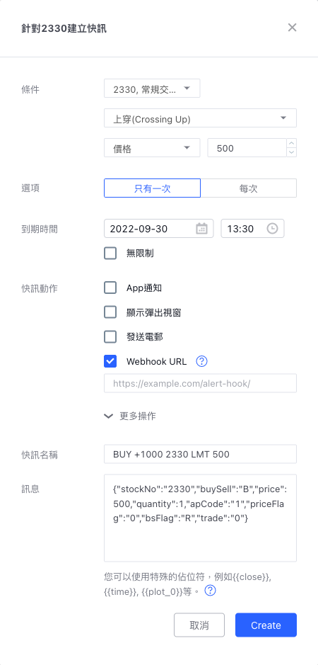
  <figcaption><em>圖 18</em></figcaption>
  <br><br>
</figure>

以上設定範例表示，當台積電股價向上穿越 500 元時，向 Webhook URL 發出 POST 請求下單委託，限價 500 元買進 1 張台積電股票。按下「Create」之後，就可以建立 TradingView 快訊以及 Webhook 設定。

### 透過 TradingView Webhook 執行自動化下單

當快訊觸發時，TradingView 會透過以下 IP 位址向 Webhook URL 發出請求：

- `52.89.214.238`
- `34.212.75.30`
- `54.218.53.128`
- `52.32.178.7`

我們需要設定「白名單」允許這些 IP 存取股票下單 API。開啟專案目錄下的 `.env` 檔案，將這些 IP 至加入 `ALLOWED_IPS` 的環境變數設定，並且每個 IP 位址以逗號 `,` 分隔：

```
ALLOWED_IPS="52.89.214.238,34.212.75.30,54.218.53.128,52.32.178.7"
```

設定完成後就可以啟動 Nest 應用程式：

```sh
$ npm start
```

當快訊條件觸發時，TradingView 就會向 Webhook URL 發出 POST 請求。當股票下單 API 收到請求後，就會進行下單委託動作，並於收到委託回報時，透過 LINE Notify 向使用者推播訊息：

<figure>
  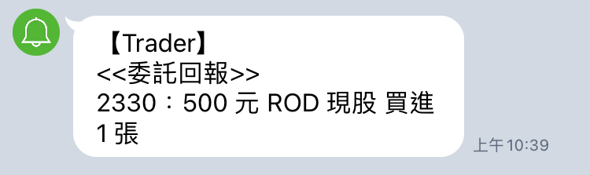
  <figcaption><em>圖 19</em></figcaption>
  <br><br>
</figure>

TradingView 擁有全球市場的行情數據，並且可以在 TradingView 上建立技術指標與交易策略。透過設定快訊（Alerts）與 Webhooks 製作交易訊號，只要結合券商交易 API，就可以很容易地實現自動化下單服務。

TradingView 提供強大的圖表功能、股票篩選器、策略測試器以及快訊等豐富的功能，對於程式交易者來說是實用的利器。不過 TradingView Webhooks 並非免費服務，這裡就提供另一種實現自動化交易的方案給讀者參考。

欲查看完整的程式碼，請參考我們的 GitHub [repo](https://github.com/chunkai1312/fugle-tradingview-webhooks)。

## 工商時間

筆者著作《Node.js 量化投資全攻略：從資料收集到自動化交易系統建構實戰》已出版，這本書將是市面上第一本以 Node.js 為例的量化投資專書，並使用 NestJS 和 JS 生態圈工具來打造屬於自己的投資利器！本書的內容專為台灣股市特有的環境量身而寫，提供了豐富內容與實用範例，歡迎參考選購，開始你的量化投資之旅！

**購書連結：**
[天瓏網路書店](https://www.tenlong.com.tw/products/9786263336070) |
[博客來網路書店](https://www.books.com.tw/products/0010970613) |
[誠品書店](https://www.eslite.com/product/10012011762682463156005) |
[蝦皮購物](https://shopee.tw/product/728783014/22357449944/) |
[momo購物網](https://www.momoshop.com.tw/goods/GoodsDetail.jsp?i_code=11954040)


